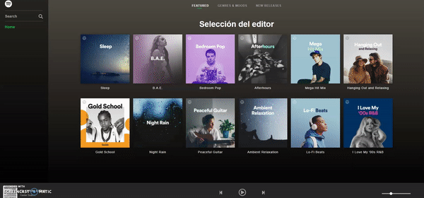

# Spotify clone

https://khiz-spotify.netlify.app

Basic functionality; log in and search for music.
Plays 30 second "trailers" of songs.

### Installation

Clone the repo and run `npm i` and then `npm run start-all`.
