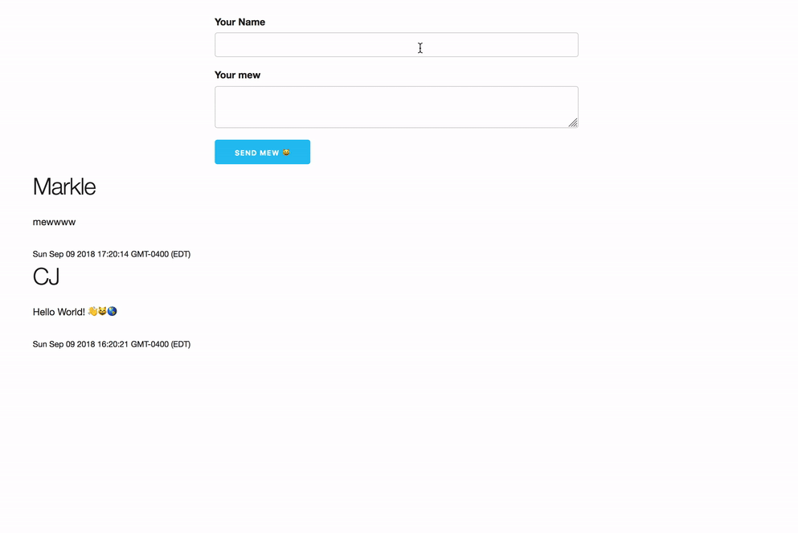

# Twitter clone

Features:

- Send a comment 
- See all comments that have been sent 

## Deploy

* Deploy server with now
  * [x] Setup environment variables
    * [x] Database connection
      * process.env.MONGO_URI
  * ✅ Show mlab
  * [ ] Deploy with environment variable
    * now -e MONGO_URI=@commenter-db
  * [ ] Add alias
* ✅ Deploy client folder with now
  * [ ] Set API_URL based on hostname
