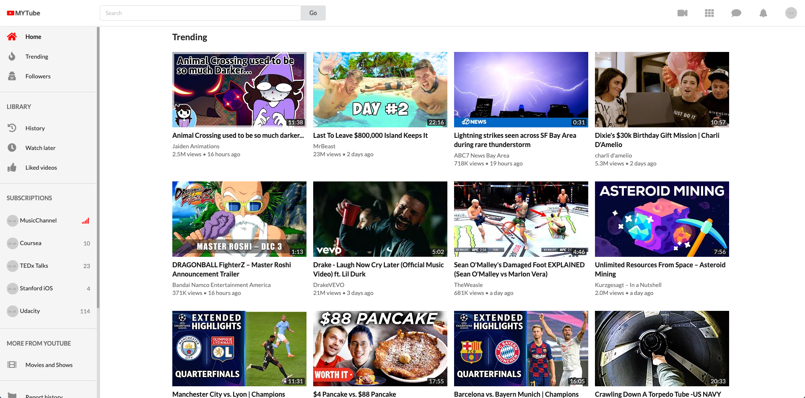
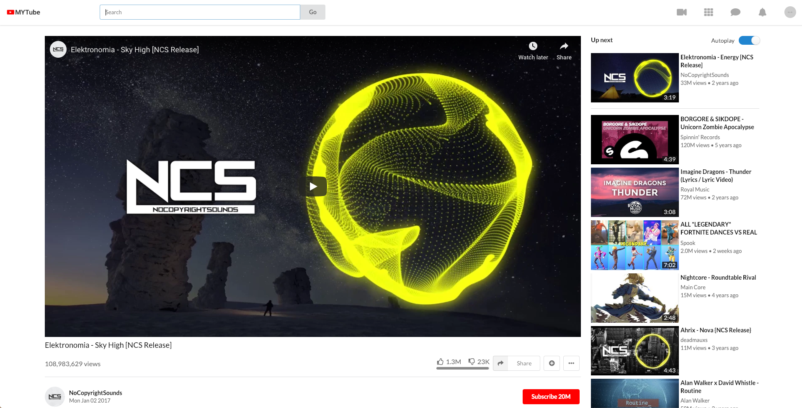
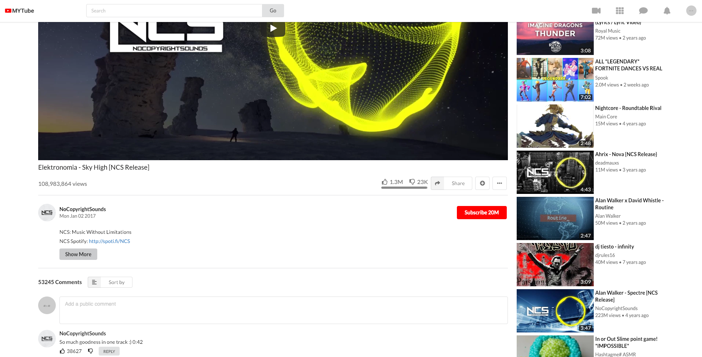

I took this off live because the API requests costs too much. To run it do the following: clone repo, enter youtube v2 folder, get your own youtube data api key and place into app.js then finally run following commands in order -> npm i, npm build, npm install -g serve, serve -s build

# Features

This application includes the major features of Youtube such as

- home feed with infinite scroll
- trending videos
- searching for videos
- watching videos
- displaying comments and video details

# Screenshots

Looks almost exactly like the original Youtube application








--------------------------------------------------------------------------------------------------

### API key

[Youtube Data API v3](https://developers.google.com/youtube/v3/docs/).

Hardcode the API key in the `src/App.js` file (or you can set up an .env.local file):

const API_KEY = 'AIzaxxxxxxxxxxxxxxxxxxxxxxxxxxxxxxxxxx';


## Running the application

If you copied and pasted the API key directly into the code, you do not need to source anything and you can just run:

```
npm start
```

If you are using [yarn](https://yarnpkg.com/lang/en/), you can do

```
yarn start
```

# Tests

This project contains an extensive suite of tests and makes use of [Jest](https://jestjs.io/) and [Enzyme](https://github.com/airbnb/enzyme).

Run all tests by executing.

```
npm test
```

You can also use [yarn](https://yarnpkg.com/lang/en/) to run the tests.

```
yarn test
```

# Tech

- [React / create-react-app](https://github.com/facebook/create-react-app)
- [Redux](https://redux.js.org/)
- [Redux-saga](https://redux-saga.js.org/)
- [Redux-reselect](https://github.com/reduxjs/reselect)
- [Jest](https://jestjs.io/)
- [Enzyme](https://airbnb.io/enzyme/)
- [Semantic UI](https://react.semantic-ui.com/)
- CSS Grid / Flexbox
